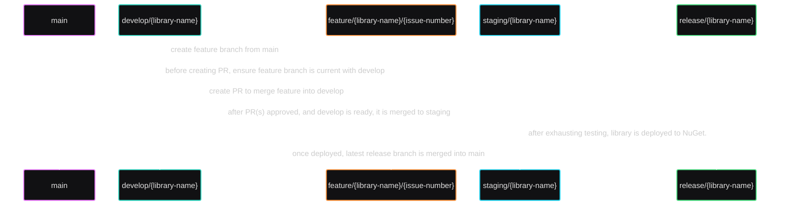

## GitFlow & PRs

Non-maintainers will almost exclusively use PRs. Start by forking the repository and then submit your PR.

In short:

1. Fork the repository and create your branch from `main`.
    - The name of the branch should use the following pattern: `feature/{library-name}/{issue-number}`.
    - The `{library-name}` must be either the main library's name `core` or any of the other sub-library names (e.g., `mediator`). For a full list of library names and branches,
      see [Branches & Library Names](#list-of-branches--current-library-names).
    - The `{issue-number}` must be the related GH issue in this repository. If an issue does not exist yet, please create it first.
2. If you've added code that should be tested, please add tests.
3. If you've changed APIs, please update the documentation.
4. Ensure all existing tests pass.
5. Ensure your code is properly formatted and is consistent with the existing code.
6. Ensure all types, members, etc. are properly documented with XML comments.
7. Submit your PR!
    - PRs should merge into the respective development branch. For example, if your feature branch was for the primary `core` library, then your PR should be merging into
      `develop/core`.

Some helpful resources by [Ardalis](https://github.com/ardalis):

- [PR Check List](https://ardalis.com/github-pull-request-checklist/)
- [Resync your fork with this upstream repo](https://ardalis.com/syncing-a-fork-of-a-github-repository-with-upstream/)

### Ask First

As mentioned above, all feature branches should be tied to an issue. Naturally, issues should then be created first. Of course, you can always just randomly create a PR without a
properly formatted branch name or corresponding issue. However, it's much more polite to create your issue first, or comment on an existing issue, letting everyone know what you're
doing. Not only does it help keep everything conformed and everyone on the same page, it's significantly more likely to be accepted.

### GitFlow

I am using a pretty simple GitFlow, which I've visualized with the following diagram:

1. After each release, the release branch is merged into the `main` branch. This keeps the `main` branch current at all times.
2. When you start a new feature branch, you create it off of `main`. We do this, as opposed to creating it off the corresponding `develop` branch, to ensure that the feature branch
   is started with the most recent official changes.
3. After finishing your work, but before creating your PR, you'll want to merge the corresponding development branch into your feature branch. This ensures your work has any
   recently completed features yet to be released. Then, when your PR gets approved, the corresponding development branch will not only have the latest releases (i.e., be current
   with the `main` branch), it will also have all the new code ready for the next release.
4. Once the development branch is at a good point to be released, it's moved into a staging branch where it is exhaustively tested. Once it passes all tests and I am satisfied it
   works without issue, it is then merged into a new release branch and deployed to NuGet.
5. Finally, after being deployed, the release branch is merged into `main`.

This GitFlow ensures that A) the `main` branch is always our current, source-of-truth; B) the development branches are not only routinely caught up with `main` but ahead; C)
features are completely tried and tested before release; and D) everything comes back full-circle.

#### List of Branches & Current Library Names

- `core` - name of primary library `Erdmier.DomainCore`
    - `develop/core`
    - `staging/core`
    - `release/core`
- `mediator` - name of sub-library `Erdmier.DomainCore.Mediator`
    - `develop/mediator`
    - `staging/mediator`
    - `release/mediator`

## Getting Started

Look for issues marked with the [_good first
issue_](https://github.com/JustinianErdmier/Erdmier.DomainCore/issues?q=is%3Aissue%20state%3A%20open%20label%3A%22good%20first%20issue%22) and/or [_help
wanted_](https://github.com/JustinianErdmier/Erdmier.DomainCore/issues?q=is%3Aissue%20state%3A%20open%20label%3A%22help%20wanted%22) labels. These issues are generally good places
to start contributing.

## License

Any code submitted to this repository are understood to be under the same [MIT License](https://github.com/JustinianErdmier/Erdmier.DomainCore/blob/main/LICENSE.md) that covers
this library.

## Bugs & Requests

I am using GH Issues to track bugs and progress for this library. You can report bugs or submit requests
by [creating an issue](https://github.com/JustinianErdmier/Erdmier.DomainCore/issues/new/choose)!
