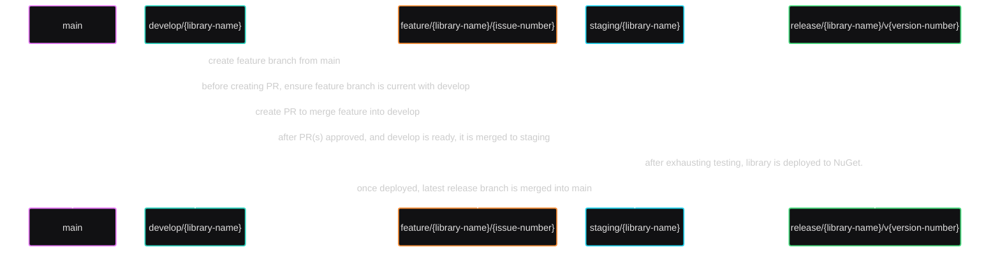

# `Erdmier.DomainCore`

__
__
__
__
__
__

A small and lightweight library designed to give you the core essentials for implementing your domain layer (following Domain Driven Design). The primary benefit to this library is
that it works well with EF Core. Extremely, heavily based on the design and implementation by [Amichai Mantinband](https://github.com/amantinband) in
his [REST API w/ Clean Architecture & DDD](https://youtube.com/playlist?list=PLzYkqgWkHPKBcDIP5gzLfASkQyTdy0t4k&si=aULsyZmIpAnLQjT7) tutorial. Most of the changes I have made to
this code are syntactical.

## Sub-libraries

`Erdmier.DomainCore.Mediator`:

__
__

## Table of Contents

1. [Features](#features)
2. [Road Map](#road-map)
3. [Installing](#installing)
4. [Examples](#examples)
5. [Contribute](#contribute)

# Features

* Designed to work with EF Core with no additional setup/boilerplate.
* Easily extensible and requires little to no additional custom base class implementations.
* Intuitive and understandable.

# Road Map

This isn't so much a road map as it is a few ideas I would like to see added sometime in the future. Some of these items are listed in the Issues tab, and I plan to address them
soon.

* **Serialization:** There is an issue with trying to deserialize and then serialize aggregates due to the inheritance combined with the type generics. However, as pointed out by
  Amichai, there shouldn't be a reason why you would want your actual aggregate objects used outside your main system (e.g., if you're using Blazor). You would want to follow
  the examples he gave in his tutorial, providing a DTO for each. However, if you are using Blazor, there would be considerable benefit to using your defined value objects.
  Serialization should work out-the-box with types derived from `ValueObject`, but I'd like to add some features/configurations that make the experience much easier for consumers.
* **Source Generation:** This is mostly something I'd like to learn, and this could be a good excuse lol. I'm thinking that it would be nice to be able to implement the
  `ValueObject.GetEqualityComponents()` body via source generation by automatically detecting your model's properties. Of course, there would have to be some way to signal to the
  generator _not_ to do include certain members, but that could easily be done with an annotation (I think lol).
* **Basic/Simple Value Type Derivations:** I'm not too concerned with this, but I have thought about it from time to time. I think there could be some benefit to providing default
  value objects for common concerns (e.g., emails, phone numbers, addresses, etc.). Of course, while this seems like it would be nice, there would be a lot of considerations for
  each one depending on how many potential users I'd like to use it. For example, every country has their own way of defining phone numbers and zip codes. There's also the question
  of whether it's really within scope of this library. The main purpose of this library is to not have to copy-and-paste the code for these base classes every time I start a new
  project. And while I haven't done any sort of advertising or anything at all, over 400 people have downloaded this library. I was astonished by that and to be honest, it's what
  kept me interesting in polishing it. That's all to say, I'd hate to add bloat to something that's really meant to be lean and clean.

# Installing

Add the NuGet package.

```shell
dotnet add package Erdmier.DomainCore
```

# Examples

I am working on adding tests at the moment. Once I am finished with that, I plan to add some demos and perhaps even thorough documentation in addition to the XAML documentation in
the source code. There is no official ETA, but it is on my list of things to do!

# Contribute

> This contribution section is based on the one used by [Ardalis' `SmartEnum`](https://github.com/ardalis/SmartEnum/blob/main/CONTRIBUTING.md) project.

I would be absolutely ecstatic if anyone wanted to help grow this project with me! Hopefully the following information will help make the process of contributing as easy and
transparent as possible.

## GitFlow & PRs

Non-maintainers will almost exclusively use PRs. Start by forking the repository and then submit your PR.

In short:

1. Fork the repository and create your branch from `main`.
    - The name of the branch should use the following pattern: `feature/{library-name}/{issue-number}`.
    - The `{library-name}` must be either the main library's name `core` or any of the other sub-library names (e.g., `mediator`). For a full list of library names and branches,
      see [Branches & Library Names](#list-of-branches--current-library-names).
    - The `{issue-number}` must be the related GH issue in this repository. If an issue does not exist yet, please create it first.
2. If you've added code that should be tested, please add tests.
3. If you've changed APIs, please update the documentation.
4. Ensure all existing tests pass.
5. Ensure your code is properly formatted and is consistent with the existing code.
6. Ensure all types, members, etc. are properly documented with XML comments.
7. Submit your PR!
    - PRs should merge into the respective develop branch. For example, if your feature branch was for the primary `core` library, then your PR should be merging into `dev/core`.

Some helpful resources by [Ardalis](https://github.com/ardalis):

- [PR Check List](https://ardalis.com/github-pull-request-checklist/)
- [Resync your fork with this upstream repo](https://ardalis.com/syncing-a-fork-of-a-github-repository-with-upstream/)

### Ask First

As mentioned above, all feature branches should be tied to an issue. Naturally, issues should then be created first. Of course, you can always just randomly create a PR without a
properly formatted branch name or corresponding issue. However, it's much more polite to create your issue first, or comment on an existing issue, letting everyone know what you're
doing. Not only does it help keep everything conformed and everyone on the same page, it's significantly more likely to be accepted.

### GitFlow

I am using a pretty simple GitFlow, which I've visualized with the following diagram:



1. After each release, the release branch is merged into the `main` branch. This keeps the `main` branch current at all times.
2. When you start a new feature branch, you create it off of `main`. We do this, as opposed to creating it off the corresponding `develop` branch, to ensure that the feature branch
   is started with the most recent official changes.
3. After finishing your work, but before creating your PR, you'll want to merge the corresponding development branch into your feature branch. This ensures your work has any
   recently
   completed features yet to be released. Then, when your PR gets approved, the corresponding development branch will not only have the latest releases (i.e., be current with the
   `main` branch), it will also have all the new code ready for the next release.
4. Once the development branch is at a good point to be released, it's moved into a staging branch where it is exhaustively tested. Once it passes all tests and I am satisfied it
   works without issue, it is then merged into a new release branch and deployed to NuGet.
5. Finally, after being deployed, the release branch is merged into `main` and deleted.

This GitFlow ensures that A) the `main` branch is always our current, source-of-truth; B) the development branches are not only routinely caught up with `main` but ahead; C)
features are completely tried and tested before release; and D) everything comes back full-circle.

#### List of Branches & Current Library Names

- `core` - name of primary library `Erdmier.DomainCore`
    - `develop/core`
    - `staging/core`
    - `release/core/v{version-number}` (e.g., `release/core/v1.0.0`)
- `mediator` - name of sub-library `Erdmier.DomainCore.Mediator`
    - `develop/mediator`
    - `staging/mediator`
    - `release/mediator/v{version-number}` (e.g., `release/mediator/v1.0.0`)

## Getting Started

Look for issues marked with the [_good first
issue_](https://github.com/JustinianErdmier/Erdmier.DomainCore/issues?q=is%3Aissue%20state%3A%20open%20label%3A%22good%20first%20issue%22) and/or [_help
wanted_](https://github.com/JustinianErdmier/Erdmier.DomainCore/issues?q=is%3Aissue%20state%3A%20open%20label%3A%22help%20wanted%22) labels. These issues are generally good places
to start contributing.

## License

Any code submitted to this repository are understood to be under the same [MIT License](https://github.com/JustinianErdmier/Erdmier.DomainCore/blob/main/LICENSE.md) that covers
this library.

## Bugs & Requests

I am using GH Issues to track bugs and progress for this library. You can report bugs or submit requests
by [creating an issue](https://github.com/JustinianErdmier/Erdmier.DomainCore/issues/new/choose)!
